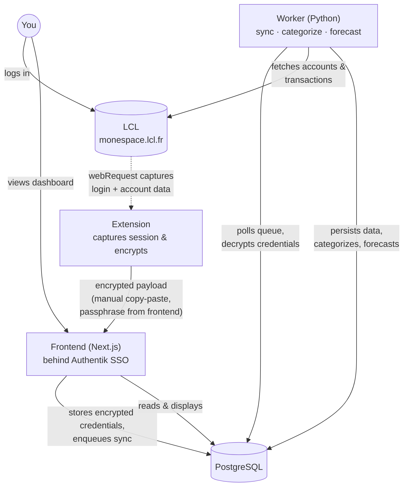

<div align="center">
  

  # Prisme

  **Track your money across LCL accounts, assets, debts, and goals, self-hosted and behind your own SSO.**

  [](#--disclaimer)
  [](LICENSE)
  [](https://nextjs.org)
  [](https://www.python.org)
  [](https://www.postgresql.org)
</div>


## ⚠️ • Disclaimer

This relies on an **unofficial, reverse-engineered** [LCL](https://www.lcl.fr/) API and deals with **real banking credentials**. It's built for personal use against my own account, so use it at your own risk, and never commit or share captured identifiers, keypads, or session tokens. This is also a personal project, not a polished product: expect missing pieces, sharp edges, and breaking changes.


## 📋 • Table of Contents

- [📖 • Overview](#--overview)
- [🧩 • Components](#--components)
- [🛠️ • Tech Stack](#️--tech-stack)
- [🚀 • Getting Started](#--getting-started)
  - [Prerequisites](#prerequisites)
  - [Installation](#installation)
  - [Environment Variables](#environment-variables)
  - [Running Locally](#running-locally)
- [📁 • Project Structure](#--project-structure)
- [🐳 • Docker Deployment](#--docker-deployment)
- [📦 • Releases](#--releases)
- [🤝 • Contributing](#--contributing)
- [🙌 • Credits](#--credits)
- [📄 • License](#--license)


## 📖 • Overview

Prisme is a personal money-tracking app built around [LCL](https://www.lcl.fr/), a French bank with no official public API. It reverse-engineers LCL's private web API (`monespace.lcl.fr/api`) to pull account balances and transactions into a PostgreSQL database you control, then displays everything in a dashboard behind your own SSO.

Key features:
- Sync current and savings accounts, balances, and transactions straight from LCL
- Hierarchical, user-defined transaction categories, with local (non-cloud) ML category suggestions
- Net worth tracking: manually-tracked assets, debts, cash on hand, and Cheques-Vacances
- Savings goals (fixed target or recurring) and per-category monthly budgets
- Income forecasting from your own categorized salary history
- Shared/joint account support: multiple Prisme users can sync the same LCL account
- Authentication via Authentik (OIDC SSO); no separate Prisme accounts/passwords


## 🧩 • Components

The project is split into three pieces under `src/`, meant to run as a pipeline:



| Component | Status | Description |
|---|---|---|
| [`src/extension`](src/extension) | Working | A browser extension you run once while logging into `monespace.lcl.fr`. It captures the session credentials from that login, encrypts them, and lets you hand them off to the frontend. |
| [`src/worker`](src/worker) | Working | A Python service that decrypts those credentials, calls LCL's API (balances, transactions, savings accounts), persists everything to PostgreSQL, predicts transaction categories, and forecasts income. |
| [`src/frontend`](src/frontend) | Working | A Next.js dashboard behind Authentik SSO: accounts, transactions, budgets, goals, assets/debts, and the onboarding flow that pairs a user with their LCL credentials. |


## 🛠️ • Tech Stack

| Layer | Technology |
|---|---|
| Frontend | [Next.js 16](https://nextjs.org) (App Router, React 19), TypeScript 5 |
| Styling / UI | Tailwind CSS v4, [shadcn/ui](https://ui.shadcn.com), Radix / base-ui |
| Charts | [Recharts](https://recharts.org) |
| Auth | [NextAuth.js](https://next-auth.js.org) + [Authentik](https://goauthentik.io) (OIDC SSO) |
| Worker | Python 3.13, managed with [uv](https://docs.astral.sh/uv/) |
| LCL client | [aiohttp](https://docs.aiohttp.org) (reverse-engineered LCL API, `lib/LCLPy`) |
| Categorization | [scikit-learn](https://scikit-learn.org) (local TF-IDF + logistic regression, per user) |
| Database | PostgreSQL 17 (`pgcrypto` for credential encryption, `pg_trgm` for search) |
| Extension | WebExtension Manifest V3, bundled with webpack |
| Containerization | Docker Compose |


## 🚀 • Getting Started

### Prerequisites

- [Node.js](https://nodejs.org) ≥ 20 and npm (frontend + extension)
- Python ≥ 3.13 and [uv](https://docs.astral.sh/uv/) (worker)
- Docker & Docker Compose (PostgreSQL, and optionally the worker)
- A browser (Chrome or Firefox) to load the extension
- An [Authentik](https://goauthentik.io) instance (or another OIDC provider, if you adapt [`src/frontend/lib/auth.ts`](src/frontend/lib/auth.ts)) for SSO

### Installation

```bash
# 1. Clone the repository
git clone https://github.com/PaulBayfield/Prisme.git
cd Prisme

# 2. Install the extension's dependencies
cd src/extension && npm install && cd ../..

# 3. Install the worker's dependencies
cd src/worker && uv sync && cd ../..

# 4. Install the frontend's dependencies
cd src/frontend && npm install && cd ../..
```

### Environment Variables

Prisme has three independent `.env` scopes:

**1. Repo root `.env`**, read by `docker-compose.yml` to provision PostgreSQL:

| Variable | Required | Description |
|---|---|---|
| `POSTGRES_DATABASE` | **Yes** | Database name |
| `POSTGRES_USER` | **Yes** | Database user |
| `POSTGRES_PASSWORD` | **Yes** | Database password |

**2. `src/worker/.env`**, read by the worker and its scripts:

| Variable | Required | Description |
|---|---|---|
| `POSTGRES_HOST` | No (default `localhost`) | PostgreSQL host |
| `POSTGRES_PORT` | No (default `5432`) | PostgreSQL port |
| `POSTGRES_DATABASE` | **Yes** | Database name |
| `POSTGRES_USER` | **Yes** | Database user |
| `POSTGRES_PASSWORD` | **Yes** | Database password |
| `CREDENTIALS_ENCRYPTION_KEY` | **Yes** | pgcrypto passphrase used to decrypt stored LCL credentials, must match the frontend's value |

**3. `src/frontend/.env.local`**, copied from [`.env.example`](src/frontend/.env.example):

| Variable | Required | Description |
|---|---|---|
| `POSTGRES_*` | **Yes** | Same PostgreSQL connection info as above |
| `NEXTAUTH_URL` | **Yes** | Public URL of the frontend |
| `NEXTAUTH_SECRET` | **Yes** | Run `openssl rand -base64 32` |
| `AUTHENTIK_ISSUER` | **Yes** | Your Authentik issuer URL |
| `AUTHENTIK_CLIENT_ID` | **Yes** | OIDC client id (Authentik admin → Applications) |
| `AUTHENTIK_CLIENT_SECRET` | **Yes** | OIDC client secret |
| `AUTHENTIK_USER_INFO_URL` | **Yes** | Authentik userinfo endpoint |
| `CREDENTIALS_ENCRYPTION_KEY` | **Yes** | Must be the exact same value as in `src/worker/.env` |

### Running Locally

```bash
# 1. Start PostgreSQL
docker compose up -d prisme-db

# 2. Run the worker (polls the sync queue, syncs every connected user hourly)
cd src/worker
uv run python __main__.py

# 3. Run the frontend
cd src/frontend
npm run dev
```

The frontend is available at [http://localhost:3000](http://localhost:3000). After onboarding, go to **Settings → Compte** to connect an LCL account: generate a passphrase there, paste it into the extension popup, then paste the encrypted result back.

To build and load the extension:

```bash
cd src/extension
npm install
npm run dev   # one-off development build into dist/
```

Then load `src/extension/dist` as an unpacked extension: `chrome://extensions` → Developer mode → *Load unpacked* (Chrome), or `about:debugging` → *Load Temporary Add-on* (Firefox).


## 📁 • Project Structure

```
Prisme/
├── .github/
│   ├── dependabot.yml
│   └── workflows/
│       └── extension-release-please.yml   # Builds, zips & releases the extension
├── docker-compose.yml                      # PostgreSQL + worker
├── src/
│   ├── extension/                          # WebExtension (MV3) - captures LCL credentials
│   │   ├── src/
│   │   │   ├── background.js               # webRequest listener, captures login/account data
│   │   │   ├── popup.js                    # encrypts captured data for export
│   │   │   └── main.js                     # content script injected on monespace.lcl.fr
│   │   ├── popup.html
│   │   ├── manifest.json
│   │   └── webpack/
│   ├── worker/                             # Python service - syncs LCL data into PostgreSQL
│   │   ├── lib/LCLPy/                      # Reverse-engineered LCL API client
│   │   ├── script/                         # decrypt.py, seed_credentials.py, import_legacy_transactions.py
│   │   ├── tests/test_client.py            # manual smoke test (not run in CI)
│   │   ├── worker.py                       # syncs one user's accounts/balances/transactions
│   │   ├── categorizer.py                  # local ML category prediction
│   │   ├── income_forecast.py
│   │   ├── schema.sql
│   │   └── __main__.py                     # sync queue daemon entry point
│   └── frontend/                           # Next.js dashboard behind Authentik SSO
│       ├── app/                            # App Router pages (accounts, budgets, goals, ...)
│       ├── components/                     # UI components (shadcn/ui based)
│       └── lib/                            # data.ts / actions.ts / auth.ts / db.ts
└── LICENSE
```


## 🐳 • Docker Deployment

```bash
docker compose up -d
```

This starts:
- **`prisme-db`**: PostgreSQL 17, initialized from [`src/worker/schema.sql`](src/worker/schema.sql)
- **`prisme-worker`**: reads `src/worker/.env`, polls the sync queue every 10 seconds, and enqueues a full sync per connected user every hour

The frontend isn't part of `docker-compose.yml` yet, so run it with `npm run build && npm start` from `src/frontend`, or deploy it to your own Node host behind your reverse proxy / Authentik.


## 📦 • Releases

The extension has its own release-please workflow ([`extension-release-please.yml`](.github/workflows/extension-release-please.yml), scoped to `src/extension/**`): on merge to `main`, it builds the production bundle, zips it, renames it to `.xpi`, attaches it to a GitHub release, and updates `.ff_updates.json` (the Firefox self-hosted update manifest). The worker and frontend aren't packaged or deployed via CI yet.


## 🤝 • Contributing

This is a personal, single-maintainer project (see [Disclaimer](#--disclaimer)), so there's no formal `CONTRIBUTING.md` or process. Issues and pull requests are still welcome if something's broken or you have a suggestion.


## 🙌 • Credits

| Person | Role |
|---|---|
| [Paul Bayfield](https://github.com/PaulBayfield) | Creator & maintainer |


## 📄 • License

Prisme is licensed under the [Apache 2.0 License](LICENSE).

```
Copyright 2026 Paul Bayfield

Licensed under the Apache License, Version 2.0 (the "License");
you may not use this file except in compliance with the License.
You may obtain a copy of the License at

http://www.apache.org/licenses/LICENSE-2.0

Unless required by applicable law or agreed to in writing, software
distributed under the License is distributed on an "AS IS" BASIS,
WITHOUT WARRANTIES OR CONDITIONS OF ANY KIND, either express or implied.
See the License for the specific language governing permissions and
limitations under the License.
```
